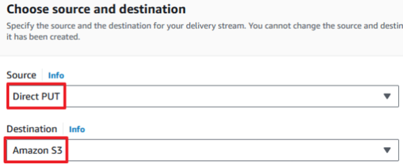

## kinesis Agent
---
### Kinesis Agent - Kinesis Data Stream

```shell
sudo yum install -y aws-kinesis-agent
sudo yum install -y httpd
sudo systemctl enable --now httpd
echo "hello world" > /var/www/html/index.html
```

```shell
systemctl start aws-kinesis-agent
chkconfig aws-kinesis-agent on
```

```shell
vim /etc/sysconfig/aws-kinesis-agent
# Set AWS credentials for accessing Amazon Kinesis Stream and Amazon Kinesis Firehose
#
# AWS_ACCESS_KEY_ID=<Access Key>
# AWS_SECRET_ACCESS_KEY=<Secret Access Key>
# AWS_DEFAULT_REGION=ap-northesat-2
#
# AGENT_ARGS=""
# AGENT_LOG_LEVEL="INFO"
```

```shell
vim /etc/aws-kinesis/agent.json
{
  "cloudwatch.emitMetrics": true,
  "kinesis.endpoint": "https://kinesis.ap-northeast-2.amazonaws.com",
  "firehose.endpoint": "",

  "flows": [
    {
      "filePattern": "/var/log/httpd/access_log",
      "kinesisStream": "<KDS Name>",
      "partitionKeyOption": "RANDOM"
    }
  ]
}
```

```shell
chmod 755 /var/log/httpd
chmod 644 /var/log/httpd/access_log
```

```shell
sudo systemctl restart aws-kinesis-agent
```

<br>

---
### Kinesis Agent - Kinesis Data Firehose



```shell
aws s3 mb s3://<S3 Bucket Name>
```

```shell
sudo yum install -y aws-kinesis-agent
sudo yum install -y httpd
sudo systemctl enable --now httpd
echo "hello world" > /var/www/html/index.html
```

```shell
sudo systemctl start aws-kinesis-agent
chkconfig aws-kinesis-agent on
```

```shell
vim /etc/sysconfig/aws-kinesis-agent
# Set AWS credentials for accessing Amazon Kinesis Stream and Amazon Kinesis Firehose
#
# AWS_ACCESS_KEY_ID=<Access Key>
# AWS_SECRET_ACCESS_KEY=<Secret Access Key>
# AWS_DEFAULT_REGION=ap-northesat-2
#
# AGENT_ARGS=""
# AGENT_LOG_LEVEL="INFO"
```

```json
vim /etc/aws-kinesis/agent.json
{
  "cloudwatch.emitMetrics": true,
  "kinesis.endpoint": "",
  "firehose.endpoint": "https://firehose.ap-northeast-2.amazonaws.com",

  "flows": [
    {
      "filePattern": "/var/log/httpd/access_log",
      "deliveryStream": "<kinesis-delivery-name>"
    }
  ]
}
```

```shell
chmod 755 /var/log/httpd
chmod 644 /var/log/httpd/access_log
```

```shell
sudo systemctl restart aws-kinesis-agent
```